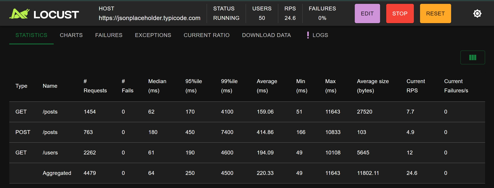
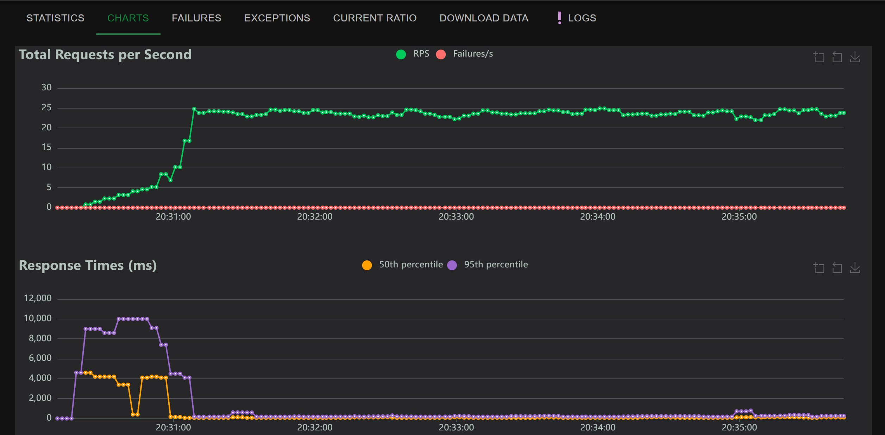
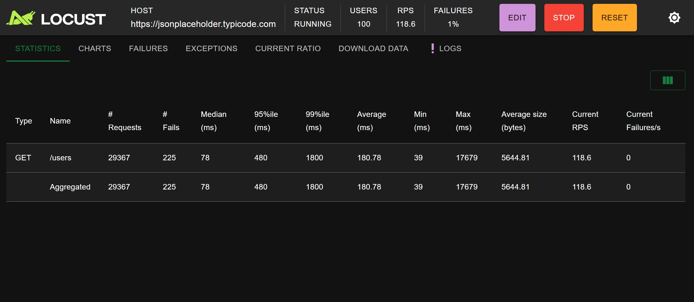
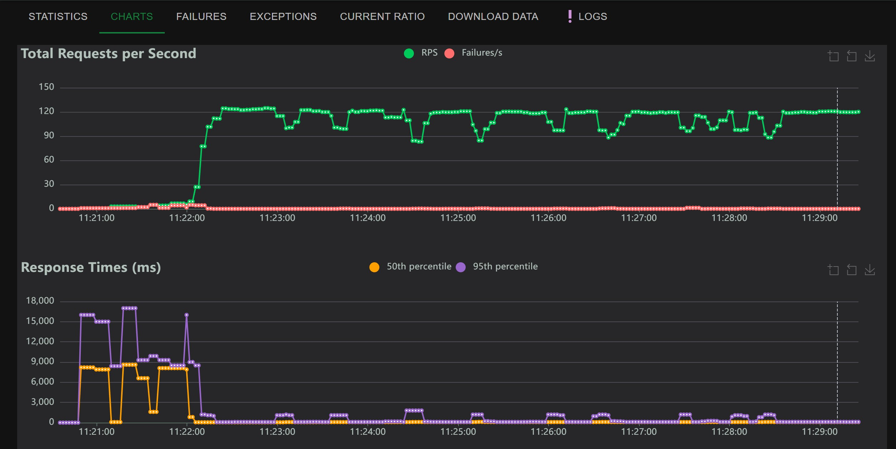
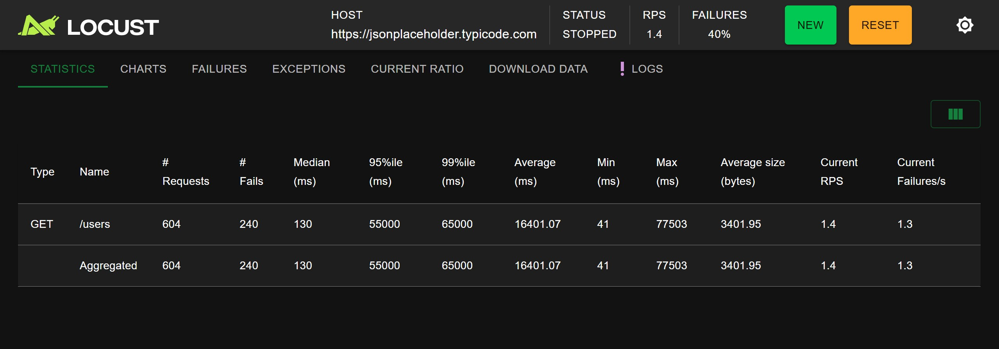
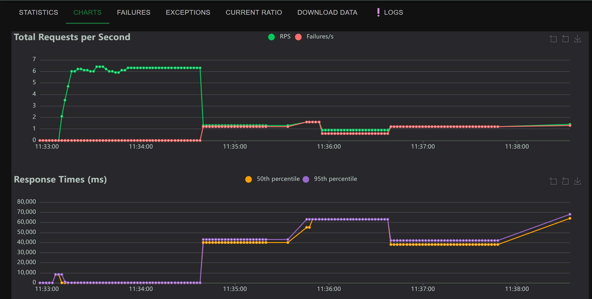

# Performance Testing Framework - Locust

[](https://github.com/arturdmt-alt/QA_Performance_Locust/actions/workflows/tests.yml) 

Professional performance testing framework using Python and Locust for load, stress, and spike testing.

## Test Results Summary

### Test 1: API Load Test
**Configuration:**
- Users: 50 concurrent
- Duration: 5 minutes
- Spawn rate: 5 users/sec
- Target: JSONPlaceholder API

**Results:**
- **Response Time (p50):** 64ms
- **Response Time (p95):** 250ms
- **Response Time (p99):** 4500ms
- **Throughput:** 24.6 req/sec
- **Total Requests:** 4479
- **Error Rate:** 0%
- **Conclusion:** System handles 50 concurrent users smoothly with excellent response times. 
All endpoints perform within acceptable thresholds.


 

---

### Test 2: Stress Test
**Configuration:**
- Users: 100 concurrent
- Duration: ~4 minutes
- Spawn rate: 10 users/sec
- Objective: Find system breaking point

**Results:**
- **Response Time (p50):** 78ms
- **Response Time (p95):** 480ms
- **Response Time (p99):** 1800ms (1.8 seconds)
- **Throughput:** 118.6 req/sec
- **Total Requests:** 29,367
- **Failures:** 225 (0.77% error rate)
- **Conclusion:** System handles 100 concurrent users effectively with <1% error rate and excellent response times. Performance remains stable under stress with graceful degradation.


 

---

### Test 3: Spike Test
**Configuration:**
- Pattern: 10 → 200 → 10 → 200 users (automatic)
- Duration: 4 minutes
- LoadTestShape: Automated spike pattern
- Objective: Test system recovery after sudden load increases

**Results:**
- **Response Time (p50):** 130ms
- **Response Time (p95):** 55,000ms (55 seconds)
- **Response Time (p99):** 65,000ms (65 seconds)
- **Total Requests:** 604
- **Failures:** 240 (40% error rate)
- **Breaking Point:** 200 concurrent users
- **Conclusion:** API has clear capacity limits. System degrades significantly above 100 concurrent users with high failure rates and severe response time degradation. **Recommendation:** Maximum 100 concurrent users for production to maintain <1% error rate and sub-second response times.


 

---

## Technology Stack

- **Python:** 3.11.9
- **Locust:** 2.32.0
- **Requests:** 2.32.2
- **Target API:** JSONPlaceholder (https://jsonplaceholder.typicode.com)
- **CI/CD:** GitHub Actions

## Running Tests Locally

### Prerequisites
- Python 3.11+
- pip

### Setup
```bash
# Clone repository
git clone https://github.com/arturdmt-alt/QA_Performance_Locust.git
cd QA_Performance_Locust

# Create virtual environment
py -3.11 -m venv venv

# Activate virtual environment
# Windows:
.\venv\Scripts\Activate.ps1
# Linux/Mac:
source venv/bin/activate

# Install dependencies
pip install -r requirements.txt
```

### Run Tests
```bash
# Load test
locust -f locustfiles/api_load_test.py

# Stress test
locust -f locustfiles/stress_test.py

# Spike test (automated)
locust -f locustfiles/spike_test.py

# Open browser to http://localhost:8089
# Configure users and spawn rate (except spike test - automatic)
```

## Project Structure
```
QA_Performance_Locust/
├── locustfiles/             # Performance test files
│   ├── api_load_test.py     # Gradual load increase test
│   ├── stress_test.py       # Find breaking point
│   └── spike_test.py        # Sudden load spikes with LoadTestShape
├── reports/
│   └── charts/              # Test result screenshots
├── config/                  # Test configuration
│   └── test_config.py       # Thresholds and settings
├── venv/                    # Virtual environment (not in git)
├── requirements.txt         # Python dependencies
├── .gitignore
└── README.md 
```

## Key Metrics Explained

### Response Time Percentiles
- **p50 (Median):** 50% of requests faster than this value
- **p95:** 95% of requests faster than this value
- **p99:** 99% of requests faster than this value

### Performance Grades
- **Excellent:** p95 < 200ms
- **Good:** p95 < 500ms
- **Fair:** p95 < 1000ms
- **Poor:** p95 > 1000ms

### Throughput
- Requests per second (RPS) the system can handle
- Higher is better

### Error Rate
- Percentage of failed requests
- Target: <1% for production systems

## Test Scenarios

### 1. Load Test
Simulates gradual user growth to establish baseline performance under normal conditions.

**Use Case:** Verify system can handle expected daily traffic.

**Tasks:**
- GET /users (weight: 3)
- GET /posts (weight: 2)
- POST /posts (weight: 1)

### 2. Stress Test
Aggressively increases load to find the system's breaking point.

**Use Case:** Identify maximum capacity and failure modes.

**Threshold:** Response time >2 seconds = failure

### 3. Spike Test
Tests system resilience during sudden traffic spikes and recovery.

**Use Case:** Prepare for viral events, marketing campaigns, or DDoS scenarios.

**Pattern:** Low → High → Low → High (automated LoadTestShape)

## Test Results Analysis

### Key Findings

1. **Optimal Performance:** System performs excellently up to 50 concurrent users (0% error rate, 250ms p95)

2. **Strong Performance:** At 100 users, system maintains <1% error rate with 480ms p95 response time

3. **Breaking Point:** System fails at 200 concurrent users (40% error rate, 55s p95)

4. **Recommendation:** 
   - **Production limit:** 100 concurrent users maximum
   - **Comfortable range:** 50 users for optimal performance
   - **Monitoring:** Alert if error rate >1% or p95 >500ms

### Bottlenecks Identified
- JSONPlaceholder API has rate limiting
- Response times spike exponentially under high load (200+ users)
- No graceful degradation - hard failure at capacity
- System performs well up to 100 users but degrades rapidly beyond

## Future Enhancements

- Add endurance testing (sustained load over hours)
- Implement custom metrics collection
- Add database performance testing
- Create automated HTML reports with charts
- Performance regression tracking across releases
- Integrate with monitoring tools (Grafana/Prometheus)
- Add authentication/authorization testing scenarios
- Distributed load testing across multiple machines

## Configuration

Test parameters can be modified in `config/test_config.py`:
```python
LOAD_TEST = {
    "users": 50,
    "spawn_rate": 5,
    "duration": "5m"
}

STRESS_TEST = {
    "users": 100,
    "spawn_rate": 10,
    "duration": "3m"
}

THRESHOLDS = {
    "p50": 200,
    "p95": 500,
    "p99": 1000
}
```

## Troubleshooting

**High CPU Warning:**
- Normal on Windows for high user counts
- Solution: Reduce concurrent users or use distributed testing

**Connection Errors:**
- Check internet connectivity
- Verify target API is accessible
- JSONPlaceholder may have rate limits

**Slow Response Times:**
- Public APIs like JSONPlaceholder can be slow
- Consider using local test API for consistent results

## Resources

- [Locust Documentation](https://docs.locust.io/)
- [Performance Testing Best Practices](https://docs.locust.io/en/stable/writing-a-locustfile.html)
- [JSONPlaceholder API](https://jsonplaceholder.typicode.com/)

## Author

**Artur Dmytriyev** - QA Automation Engineer

- GitHub: [https://github.com/arturdmt-alt](https://github.com/arturdmt-alt)
- LinkedIn: [https://www.linkedin.com/in/arturdmytriyev](https://www.linkedin.com/in/arturdmytriyev)

---

**Built as part of a comprehensive QA automation portfolio demonstrating performance testing expertise.**